<center>


**UNIVERSIDAD PRIVADA DE TACNA**

**FACULTAD DE INGENIERÍA**

**Escuela Profesional de Ingeniería de Sistemas**

**Proyecto *Dashboard de empleabilidad de los egresados de Ingeniería de Sistemas de la Universidad Privada de Tacna***

Curso: *Inteligencia de Negocios*

Docente: *CUADROS QUIROGA, PATRICK JOSE*

Integrantes:

***Pacompía Ortiz Abel Fernando (2023076797)***

***Cruz Mamani Victor Williams (2022073903)***

***Vargas Luque Jhony (2022075754)***

**Tacna – Perú**

***2026***

</center>

<div style="page-break-after: always; visibility: hidden">\pagebreak</div>

| CONTROL DE VERSIONES | | | | | |
| :-: | :- | :- | :- | :- | :- |
| **Versión** | **Hecha por** | **Revisada por** | **Aprobada por** | **Fecha** | **Motivo** |
| 1.0 | APO, CMV, VLJ | | | 06/10/2026 | Versión inicial, basada en la solución implementada |

<br>

**Sistema *Dashboard de Empleabilidad de Egresados EPIS-UPT***

**Documento de Especificación de Requerimientos de Software**

**Versión *1.0***

<div style="page-break-after: always; visibility: hidden">\pagebreak</div>

# ÍNDICE GENERAL

- [INTRODUCCIÓN](#introduccion)
- [I. GENERALIDADES DEL PROYECTO](#i-generalidades)
  - 1. [Nombre del proyecto](#i-1)
  - 2. [Visión](#i-2)
  - 3. [Misión](#i-3)
  - 4. [Organigrama del proyecto](#i-4)
- [II. VISIONAMIENTO DEL SISTEMA](#ii-visionamiento)
  - 1. [Descripción del problema](#ii-1)
  - 2. [Objetivos de negocio](#ii-2)
  - 3. [Objetivos de diseño](#ii-3)
  - 4. [Alcance del proyecto](#ii-4)
  - 5. [Viabilidad del sistema](#ii-5)
  - 6. [Información obtenida del levantamiento de información](#ii-6)
- [III. ANÁLISIS DE PROCESOS](#iii-procesos)
  - a) [Diagrama del proceso actual](#iii-a)
  - b) [Diagrama del proceso propuesto](#iii-b)
- [IV. ESPECIFICACIÓN DE REQUERIMIENTOS DE SOFTWARE](#iv-requerimientos)
  - a) [Cuadro de requerimientos funcionales inicial](#iv-a)
  - b) [Cuadro de requerimientos no funcionales](#iv-b)
  - c) [Cuadro de requerimientos funcionales final](#iv-c)
  - d) [Reglas de negocio](#iv-d)
- [V. FASE DE DESARROLLO](#v-desarrollo)
  - 1. [Perfiles de usuario](#v-1)
  - 2. [Modelo conceptual](#v-2)
  - 3. [Modelo lógico](#v-3)
  - 4. [Artefactos de requisitos complementarios](#v-4)
- [CONCLUSIONES](#conclusiones)
- [RECOMENDACIONES](#recomendaciones)
- [REFERENCIAS BIBLIOGRÁFICAS](#referencias)

<div style="page-break-after: always; visibility: hidden">\pagebreak</div>

<a id="introduccion"></a>

# INTRODUCCIÓN

El presente documento especifica los requerimientos de software del **Dashboard de empleabilidad de los egresados de Ingeniería de Sistemas de la Universidad Privada de Tacna**, una solución de Inteligencia de Negocios para el seguimiento laboral de los egresados de las promociones 2017 a 2024.

El sistema está compuesto por un pipeline de datos en Python, que integra la nómina de graduados y la evidencia laboral pública, la seudonimiza, la clasifica y la carga en un data mart dimensional sobre DuckDB, y por un tablero web estático que presenta los indicadores con filtros interactivos.

Los principales problemas que atiende son:

- La información sobre la situación laboral de los egresados está dispersa y no existe un repositorio integrado.
- La Escuela desconoce la situación laboral de la mayoría de sus egresados, y ese desconocimiento no está medido.
- Existe el riesgo de presentar cifras incorrectas, por ejemplo, contar como desempleados a egresados de quienes simplemente no hay información.
- El tratamiento de datos personales de los egresados exige medidas de protección conformes con la Ley N.º 29733.

Este documento debe leerse junto con el FD01 – Informe de Factibilidad y el FD02 – Documento de Visión, ambos en su versión 1.1.

<div style="page-break-after: always; visibility: hidden">\pagebreak</div>

<a id="i-generalidades"></a>

# I. GENERALIDADES DEL PROYECTO

<a id="i-1"></a>

## 1. Nombre del proyecto

**Dashboard de empleabilidad de los egresados de Ingeniería de Sistemas de la Universidad Privada de Tacna.** Solución de Inteligencia de Negocios compuesta por un pipeline de datos reproducible y un tablero web estático para el seguimiento laboral de los egresados de la EPIS.

<a id="i-2"></a>

## 2. Visión

Ser la herramienta de referencia de la Escuela Profesional de Ingeniería de Sistemas para conocer, con cifras verificables y honestas, la situación laboral de sus egresados y el grado en que la Escuela dispone de información sobre ellos.

<a id="i-3"></a>

## 3. Misión

Proporcionar a la Dirección de la EPIS y al Comité de Acreditación un tablero de indicadores que permita:

- Medir la cobertura de información sobre los egresados.
- Conocer los sectores, áreas, empleadores y ubicación de los egresados con evidencia laboral.
- Evaluar la afinidad entre la formación recibida y el puesto desempeñado.
- Distinguir siempre la información conocida de la desconocida.
- Proteger la identidad de los egresados en todas las etapas del proceso.

<a id="i-4"></a>

## 4. Organigrama del proyecto

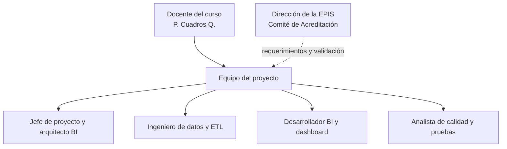

<div style="page-break-after: always; visibility: hidden">\pagebreak</div>

<a id="ii-visionamiento"></a>

# II. VISIONAMIENTO DEL SISTEMA

<a id="ii-1"></a>

## 1. Descripción del problema

### Situación actual

1. **Información dispersa:** los datos de los egresados se encuentran en la nómina de graduados publicada en la página web de la UPT y en perfiles profesionales de LinkedIn, sin integración entre sí.
2. **Información incompleta:** de los 139 egresados únicos de las promociones 2017 a 2024, solo 35 tienen un empleo verificable en fuentes públicas.
3. **Datos de origen no estructurados:** el campo que describe dónde labora cada egresado mezcla empleadores, cargos y titulares profesionales que no indican un empleo (por ejemplo, "Bachiller en Ingeniería de Sistemas").
4. **Riesgo de interpretación errónea:** sin una distinción explícita, la falta de información puede confundirse con desempleo y producir una tasa de empleabilidad falsa.
5. **Datos personales:** la nómina contiene nombres reales, por lo que su tratamiento exige medidas de protección.

### Impacto

- La Escuela no puede responder con cifras verificables qué porcentaje de sus egresados trabaja ni en qué condiciones.
- Los reportes para la acreditación se elaboran de forma manual.
- No se dispone de un indicador sobre el grado de conocimiento que la Escuela tiene de sus egresados.

<a id="ii-2"></a>

## 2. Objetivos de negocio

### Objetivos generales

1. **Medir lo que se conoce y lo que no:** reportar la cobertura de información sobre los egresados como indicador principal.
2. **Caracterizar la empleabilidad conocida:** sector, área de desempeño, empleadores, ubicación y afinidad formativa de los egresados con evidencia laboral.
3. **Apoyar la acreditación y el seguimiento:** disponer de indicadores por promoción, con denominadores explícitos y trazables.
4. **Proteger a los egresados:** ninguna salida del sistema debe permitir identificar a una persona.

### Objetivos específicos

- Construir el marco censal de egresados 2017–2024 a partir de la nómina de graduados.
- Clasificar la evidencia laboral en estados auditables.
- Construir un data mart dimensional con la fuente de cada observación.
- Calcular indicadores de cobertura, sector, área, afinidad, ámbito, empleadores y confiabilidad.
- Publicar un tablero interactivo que funcione sin servidor ni licencias.

<a id="ii-3"></a>

## 3. Objetivos de diseño

1. **Honestidad metodológica:** cada indicador se reporta sobre su denominador real y la advertencia metodológica viaja dentro del tablero.
2. **Privacidad desde el diseño:** solo la etapa de ingesta procesa nombres; el resto del sistema opera sobre seudónimos.
3. **Reproducibilidad:** el sistema completo se reconstruye con un solo comando y produce siempre el mismo resultado a partir de los mismos datos.
4. **Auditabilidad:** las reglas de clasificación son tablas explícitas, revisables en el historial del repositorio y protegidas por pruebas.
5. **Sostenibilidad:** sin servidores, licencias ni dependencias externas en el tablero.

<a id="ii-4"></a>

## 4. Alcance del proyecto

### Incluido en el proyecto

- Ingesta de la nómina de graduados con contrato de datos.
- Seudonimización de la identidad de los egresados.
- Clasificación curada de la evidencia laboral: estado, empleador, cargo, área, afinidad, sector, ámbito y confiabilidad.
- Data mart dimensional (modelo estrella) en DuckDB.
- Cálculo de indicadores con marcado de celdas pequeñas.
- Tablero web estático con tarjetas de KPIs, gráficos, filtros por promoción y sector, tablas de datos y nota metodológica.
- Pruebas automatizadas e integración continua con GitHub Actions.

### No incluido en el proyecto

- Cálculo de la tasa de empleabilidad real.
- Tiempo de inserción laboral, rango salarial y modalidad de trabajo.
- Encuestas a egresados.
- Autenticación de usuarios y gestión de roles.
- Exportación de reportes a PDF o Excel.
- Análisis predictivo.

### Límites y restricciones

- La evidencia laboral depende de lo que los egresados publican en LinkedIn.
- La nómina nominal no se versiona; debe colocarse manualmente en `data/raw/` para ejecutar la ingesta.
- La ubicación del empleo solo se declara cuando es verificable a partir del empleador.
- Los indicadores que requieren fechas de contratación o salarios quedan condicionados a una futura encuesta.

<a id="ii-5"></a>

## 5. Viabilidad del sistema

### Viabilidad técnica

**Alta.** El sistema está implementado con tecnologías maduras y de código abierto:

- Python 3.12.
- DuckDB 1.4 o superior.
- pytest.
- HTML, CSS y JavaScript sin dependencias externas.
- Git, GitHub y GitHub Actions.

### Viabilidad económica

**Alta.** No requiere licencias ni infraestructura. El costo total estimado es de S/13,030.00, compuesto principalmente por horas del equipo (ver FD01 versión 1.1).

### Viabilidad operativa

**Alta.** Un administrador puede reconstruir todo el sistema con:

```bash
pip install -r requirements.txt
make pipeline
```

Los usuarios consultan el tablero abriendo `dashboard/index.html` en cualquier navegador.

<a id="ii-6"></a>

## 6. Información obtenida del levantamiento de información

### Fuentes de información

1. **Página web oficial de la UPT:** nómina de graduados de Ingeniería de Sistemas de las promociones 2017 a 2024 (141 registros, 139 egresados únicos tras excluir 2 segundos grados).
2. **LinkedIn:** perfiles públicos de los egresados, utilizados como evidencia de su situación laboral. Según cómo se obtuvo cada observación, se distinguen cuatro tipos de fuente:

| Fuente registrada | Nivel de confiabilidad | Observaciones |
| --- | --- | --- |
| LinkedIn perfil directo | Alta | 18 |
| LinkedIn + UPT | Alta | 1 |
| LinkedIn | Media | 18 |
| LinkedIn (directorio) | Media | 15 |
| Sin fuente | — | 89 |

3. **Documentos del proyecto:** FD01 – Informe de Factibilidad y FD02 – Documento de Visión.

### Requisitos del cliente

- Conocer la situación laboral de los egresados por promoción.
- Identificar sectores, áreas y empleadores.
- Conocer la afinidad entre formación y empleo.
- Saber si los egresados permanecen en Tacna.
- Disponer de indicadores confiables para la acreditación.
- Proteger los datos personales de los egresados.

<div style="page-break-after: always; visibility: hidden">\pagebreak</div>

<a id="iii-procesos"></a>

# III. ANÁLISIS DE PROCESOS

<a id="iii-a"></a>

## a) Diagrama del proceso actual – Diagrama de actividades

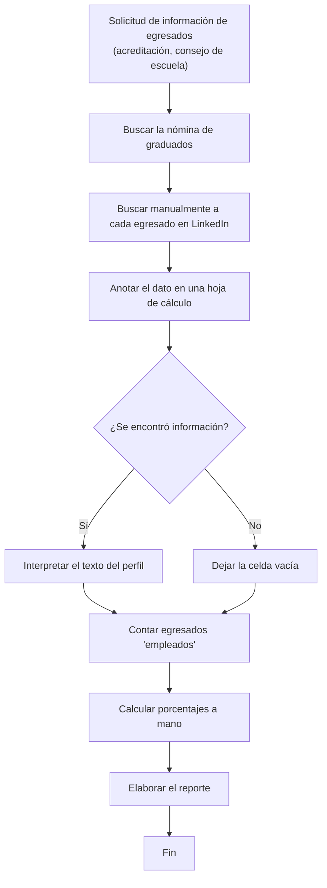

**Problemas identificados:**

- Alto tiempo de elaboración y resultados no reproducibles.
- Titulares como "Egresado UPT" pueden contarse erróneamente como empleo.
- Las celdas vacías pueden interpretarse como desempleo.
- Los nombres de los egresados circulan en hojas de cálculo sin protección.

<a id="iii-b"></a>

## b) Diagrama del proceso propuesto – Diagrama de actividades

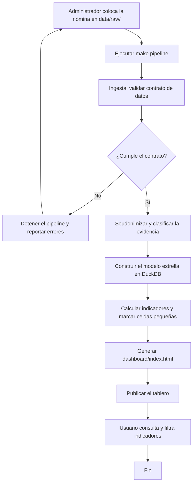

**Mejoras del proceso propuesto:**

- Reconstrucción completa en un solo comando, con resultados reproducibles.
- Reglas de clasificación explícitas que impiden contar titulares como empleo.
- La falta de información se reporta como tal, no como desempleo.
- Los nombres no salen de la etapa de ingesta.

<div style="page-break-after: always; visibility: hidden">\pagebreak</div>

<a id="iv-requerimientos"></a>

# IV. ESPECIFICACIÓN DE REQUERIMIENTOS DE SOFTWARE

<a id="iv-a"></a>

## a) Cuadro de requerimientos funcionales inicial

Requerimientos planteados en la versión 1.0 del FD01 y el FD02, y su estado tras el levantamiento de información.

| ID | Requerimiento | Descripción | Prioridad | Estado |
| --- | --- | --- | --- | --- |
| RFI01 | Tasa de empleabilidad | Mostrar el porcentaje de egresados empleados. | Alta | Reformulado como cobertura de información |
| RFI02 | Afinidad formativa | Mostrar el porcentaje de egresados en áreas afines. | Alta | Aprobado (sobre casos con cargo conocido) |
| RFI03 | Tiempo de inserción | Mostrar los meses hasta el primer empleo. | Alta | Postergado: requiere encuesta |
| RFI04 | Áreas de desempeño | Distribución por áreas profesionales. | Alta | Aprobado |
| RFI05 | Análisis por cohorte | Filtrar indicadores por año de egreso. | Alta | Aprobado |
| RFI06 | Mapa geográfico | Ubicación de los egresados. | Media | Reformulado como distribución por ámbito |
| RFI07 | Rango salarial | Distribución salarial de los egresados. | Media | Postergado: requiere encuesta |
| RFI08 | Filtros por sexo y modalidad | Segmentación por sexo y modalidad de trabajo. | Media | Postergado: datos no disponibles |
| RFI09 | Exportación | Exportar reportes a PDF o Excel. | Media | Postergado |
| RFI10 | Autenticación por roles | Restringir el acceso por perfil de usuario. | Media | Descartado: el tablero no contiene datos identificables |

<a id="iv-b"></a>

## b) Cuadro de requerimientos no funcionales

| ID | Requerimiento | Descripción | Métrica | Prioridad |
| --- | --- | --- | --- | --- |
| RNF001 | Privacidad | Ninguna salida publicable debe contener nombres, DNI ni datos de contacto. | 0 nombres en `data/seed/` y en el tablero | Alta |
| RNF002 | Seudonimización | Los identificadores deben ser deterministas y no reversibles sin la sal. | Pruebas `test_seudonimo_*` | Alta |
| RNF003 | Validez metodológica | La cobertura de información no debe presentarse como tasa de empleabilidad. | Advertencia visible en el tablero | Alta |
| RNF004 | Reproducibilidad | El mismo dato de entrada debe producir los mismos indicadores. | Modelo idempotente | Alta |
| RNF005 | Calidad de datos | Un dato inválido debe detener el pipeline. | Contrato de datos con 4 validaciones | Alta |
| RNF006 | Auditabilidad | Cada regla de clasificación debe ser revisable. | Tablas curadas versionadas | Alta |
| RNF007 | Portabilidad | El tablero debe funcionar sin servidor ni conexión. | Funciona desde `file://` | Alta |
| RNF008 | Rendimiento | El tablero debe cargar y filtrar de forma inmediata. | Archivo < 100 KB; filtrado < 1 s | Media |
| RNF009 | Accesibilidad | Los gráficos deben tener una alternativa textual y ser operables con teclado. | Vista de tabla por gráfico | Media |
| RNF010 | Compatibilidad | Funcionamiento en navegadores modernos y teléfonos. | Chrome, Edge, Firefox, Safari | Media |
| RNF011 | Integración continua | Cada cambio debe pasar las pruebas y reconstruir el tablero. | Workflow `CI` en GitHub Actions | Media |
| RNF012 | Costo | Sin licencias ni infraestructura de pago. | S/0 en ambiente tecnológico | Media |

<a id="iv-c"></a>

## c) Cuadro de requerimientos funcionales final

| ID | Requerimiento | Descripción detallada | Módulo | Estado |
| --- | --- | --- | --- | --- |
| RF001 | Ingesta de la nómina | Leer la nómina de graduados desde `data/raw/`. | `ingest.py` | Implementado |
| RF002 | Contrato de datos | Rechazar nombres vacíos, fechas inválidas, fechas fuera del rango 2017–hoy y números de registro duplicados. | `ingest.validar_contrato` | Implementado |
| RF003 | Seudonimización | Reemplazar el nombre por un identificador `EG-` derivado de SHA-256 con sal. | `ingest.seudonimizar` | Implementado |
| RF004 | Estado de la evidencia | Clasificar cada registro como empleo verificado, no confirmado, sin evidencia laboral, sin información o segundo grado. | `clasificacion.clasificar` | Implementado |
| RF005 | Separación de empleador y cargo | Separar el texto libre en empleador, cargo y área de desempeño. | `CLASIFICACION` | Implementado |
| RF006 | Resolución de alias | Unificar variantes del mismo empleador (por ejemplo, Data Consulting SAC). | `ALIAS_EMPLEADOR` | Implementado |
| RF007 | Sector y ámbito | Asignar sector y ámbito geográfico verificable a cada empleador. | `SECTOR_POR_EMPLEADOR` | Implementado |
| RF008 | Confiabilidad de la fuente | Asignar nivel alto o medio según el tipo de fuente. | `CONFIANZA_POR_FUENTE` | Implementado |
| RF009 | Revisión manual | Marcar como "Requiere revisión" los valores no catalogados, sin adivinar. | `clasificacion.clasificar` | Implementado |
| RF010 | Modelo dimensional | Construir el modelo estrella en DuckDB a partir de la semilla seudonimizada. | `modelo.py`, `modelo_estrella.sql` | Implementado |
| RF011 | Cálculo de indicadores | Calcular cobertura global y por promoción, estado de la evidencia, sector, área, afinidad, empleadores, confiabilidad y calidad de datos. | `kpis.py` | Implementado |
| RF012 | Marcado de celdas pequeñas | Marcar como suprimidos los cortes por sector y área con menos de 5 casos. | `kpis.py` | Implementado |
| RF013 | Generación del tablero | Generar un HTML autocontenido con los datos embebidos. | `tablero.py` | Implementado |
| RF014 | Tarjetas de KPIs | Mostrar cobertura, egresados, egresados con evidencia y porcentaje sin información. | `plantilla.html` | Implementado |
| RF015 | Gráficos | Cobertura por promoción, estado de la evidencia, ámbito ("¿Se quedan en Tacna?"), sector, área, empleadores con más de un egresado y confiabilidad. | `plantilla.html` | Implementado |
| RF016 | Filtros | Filtrar por promoción y sector desde botones o haciendo clic en las barras; limpiar filtros. | `plantilla.html` | Implementado |
| RF017 | Vista de tabla | Mostrar los datos exactos de cada gráfico en una tabla. | `plantilla.html` | Implementado |
| RF018 | Nota metodológica | Explicar la diferencia entre cobertura y empleabilidad, la afinidad y la lectura de celdas pequeñas. | `plantilla.html` | Implementado |
| RF019 | Tema claro y oscuro | Alternar el tema de visualización. | `plantilla.html` | Implementado |
| RF020 | Orquestación | Ejecutar ingesta, modelo, indicadores y tablero con un solo comando. | `pipeline.py`, `Makefile` | Implementado |
| RF021 | Integración continua | Ejecutar pruebas, verificar `data/raw/` y reconstruir el tablero en cada cambio. | `.github/workflows/ci.yml` | Implementado |

<a id="iv-d"></a>

## d) Reglas de negocio

### Reglas de medición

| ID | Regla |
| --- | --- |
| RN001 | La cobertura de información es el porcentaje de egresados con empleo verificado sobre el universo de egresados únicos. No es una tasa de empleabilidad. |
| RN002 | La tasa de empleabilidad se declara no estimable con fuentes públicas. |
| RN003 | Todo indicador se reporta junto con su denominador. |
| RN004 | La afinidad formativa se calcula solo sobre los casos con cargo identificable. |
| RN005 | Los cortes con menos de 5 casos se marcan como suprimidos y el tablero advierte que deben leerse con cautela. |

### Reglas de clasificación

| ID | Regla |
| --- | --- |
| RC001 | Un campo vacío se clasifica como "Sin información". |
| RC002 | Un titular profesional sin empleador (por ejemplo, "Egresado UPT") se clasifica como "Sin evidencia laboral", nunca como empleo. |
| RC003 | Un perfil sin datos laborales visibles se clasifica como "No confirmado" y no cuenta como empleo. |
| RC004 | Un segundo grado de la misma persona se marca como duplicado y se excluye de la tabla de hechos. |
| RC005 | Si se conoce el empleador pero no el cargo, la afinidad es desconocida (`NULL`), nunca falsa. |
| RC006 | Son afines las áreas de Desarrollo de Software, Datos / BI / IA, Infraestructura y Soporte, y Gestión de Proyectos. |
| RC007 | La ubicación solo se declara cuando es verificable a partir del empleador: el nombre contiene el lugar, la entidad tiene sede única o la fuente lo indica. |
| RC008 | Un valor no catalogado se marca como "Requiere revisión" en lugar de inferir su clasificación. |

### Reglas de calidad y privacidad

| ID | Regla |
| --- | --- |
| RP001 | Un registro que no cumple el contrato de datos detiene el pipeline. |
| RP002 | Solo la etapa de ingesta procesa nombres. |
| RP003 | La nómina nominal (`data/raw/`) nunca se versiona; la integración continua falla si se sube. |
| RP004 | La sal de seudonimización se guarda en `.env`, fuera del repositorio. |
| RP005 | La misma persona produce siempre el mismo seudónimo, para poder seguir su trayectoria entre actualizaciones. |

<div style="page-break-after: always; visibility: hidden">\pagebreak</div>

<a id="v-desarrollo"></a>

# V. FASE DE DESARROLLO

<a id="v-1"></a>

## 1. Perfiles de usuario

### Perfil 1: Directivo o analista académico

| Campo | Descripción |
| --- | --- |
| Objetivo | Consultar indicadores para la toma de decisiones y la acreditación. |
| Necesidades | Cifras claras, filtros por promoción y advertencias metodológicas visibles. |
| Funciones usadas | Tarjetas de KPIs, gráficos, filtros, vista de tabla y nota metodológica. |

### Perfil 2: Docente o investigador

| Campo | Descripción |
| --- | --- |
| Objetivo | Conocer los sectores y áreas en que se desempeñan los egresados. |
| Necesidades | Distribución por sector, área y empleador. |
| Funciones usadas | Gráficos de perfil laboral, filtros y vista de tabla. |

### Perfil 3: Administrador de datos

| Campo | Descripción |
| --- | --- |
| Objetivo | Mantener actualizados los datos y el tablero. |
| Necesidades | Pipeline reproducible, mensajes de error claros y reglas de clasificación editables. |
| Funciones usadas | `make pipeline`, `make test`, tablas de `clasificacion.py`. |

### Perfil 4: Desarrollador

| Campo | Descripción |
| --- | --- |
| Objetivo | Mantener y extender el sistema. |
| Necesidades | Código modular, pruebas automatizadas y decisiones documentadas. |
| Funciones usadas | Módulos de `src/empleabilidad/`, pruebas, ADR e integración continua. |

<a id="v-2"></a>

## 2. Modelo conceptual

### a) Diagrama de paquetes

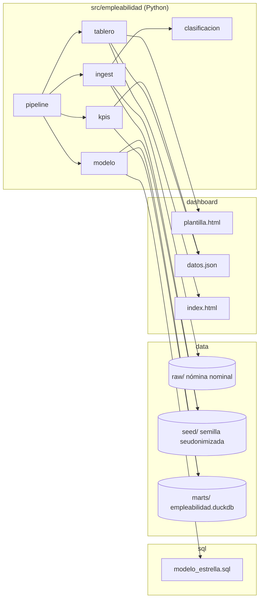

### a.1) Diagrama de contexto

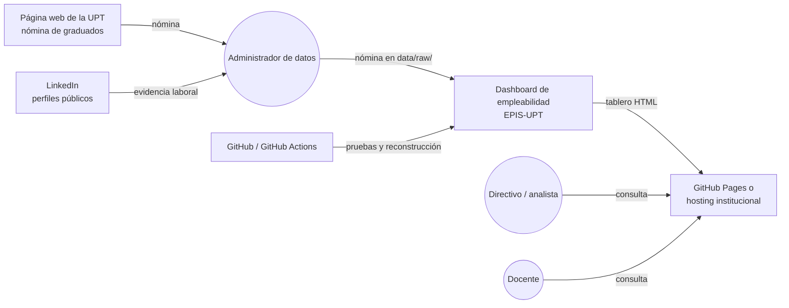

### b) Diagrama de casos de uso

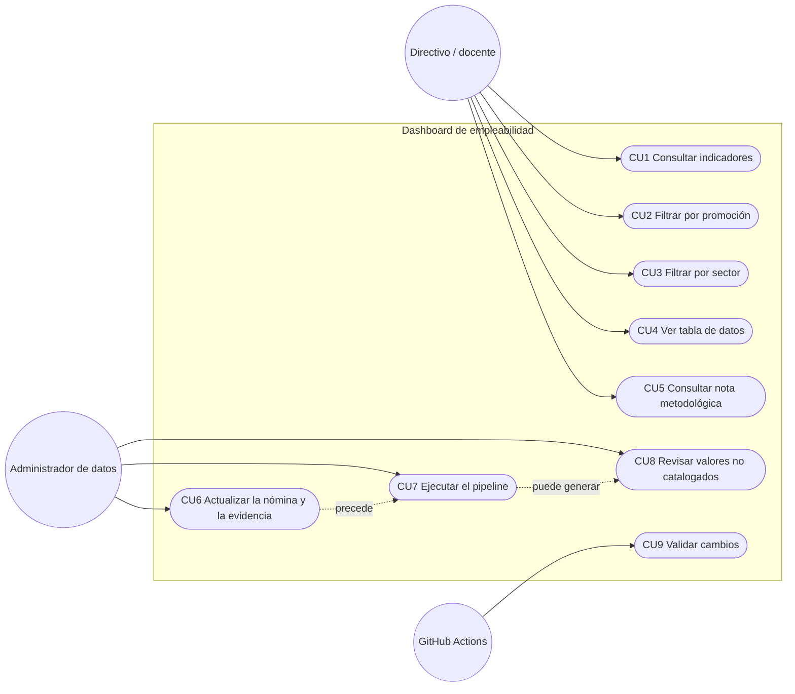

### b.1) Diagramas de casos de uso específicos

#### Caso de uso específico: consulta del tablero

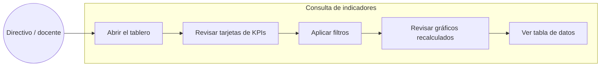

#### Caso de uso específico: actualización de datos

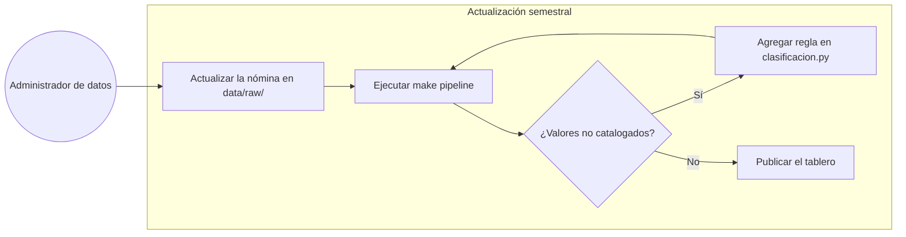

<a id="v-2-c"></a>

### c) Escenarios de caso de uso

#### Caso de uso 1: Consultar indicadores

| Campo | Descripción |
| --- | --- |
| Actor | Directivo o docente |
| Precondición | El tablero está publicado o el archivo `index.html` está disponible. |
| Flujo principal | El usuario abre el tablero; el sistema muestra las tarjetas de KPIs y los gráficos con el universo completo. |
| Flujo alterno | Si el navegador no permite almacenamiento local, el tablero funciona igual con el tema por defecto. |
| Postcondición | El usuario visualiza la cobertura de información y la advertencia metodológica. |

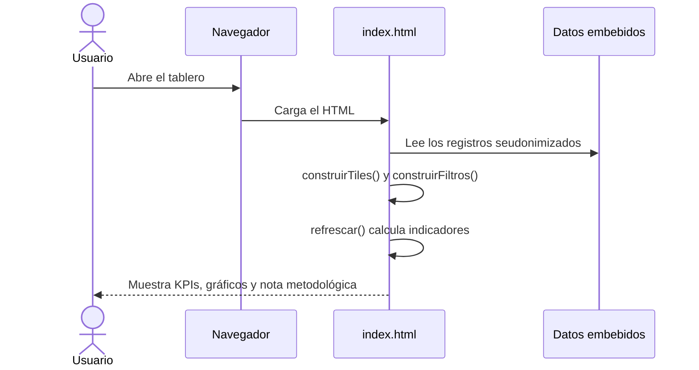

#### Caso de uso 2: Filtrar por promoción

| Campo | Descripción |
| --- | --- |
| Actor | Directivo o docente |
| Precondición | El tablero está abierto. |
| Flujo principal | El usuario pulsa el botón de una o varias promociones, o la barra correspondiente en el gráfico por promoción; el sistema recalcula todos los indicadores. |
| Flujo alterno | El usuario pulsa "Limpiar filtros" y el sistema vuelve al universo completo. |
| Postcondición | Los indicadores reflejan solo las promociones seleccionadas. |

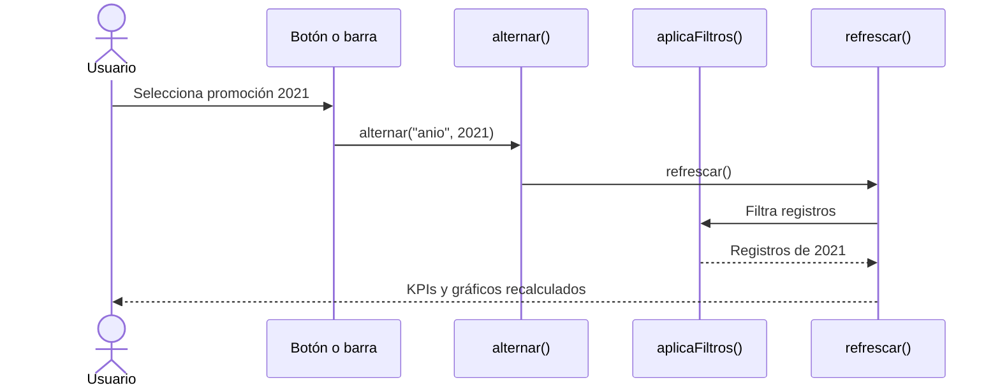

#### Caso de uso 3: Filtrar por sector

| Campo | Descripción |
| --- | --- |
| Actor | Directivo o docente |
| Precondición | El tablero está abierto. |
| Flujo principal | El usuario selecciona un sector del empleador; el sistema muestra solo los egresados con empleo verificado en ese sector. |
| Flujo alterno | Si se combina con un filtro de promoción que deja pocos casos, la nota metodológica advierte sobre la lectura de celdas pequeñas. |
| Postcondición | Los indicadores reflejan el sector seleccionado. |

#### Caso de uso 4: Ver tabla de datos

| Campo | Descripción |
| --- | --- |
| Actor | Directivo o docente |
| Precondición | El tablero está abierto. |
| Flujo principal | El usuario pulsa "Ver tabla" en un gráfico; el sistema muestra los valores exactos. |
| Postcondición | El usuario dispone de las cifras para citarlas en un reporte. |

#### Caso de uso 5: Consultar nota metodológica

| Campo | Descripción |
| --- | --- |
| Actor | Directivo o docente |
| Precondición | El tablero está abierto. |
| Flujo principal | El usuario se desplaza a la sección "Metodología" y revisa la explicación de cobertura, afinidad y celdas pequeñas. |
| Postcondición | El usuario interpreta correctamente los indicadores. |

#### Caso de uso 6: Actualizar la nómina y la evidencia

| Campo | Descripción |
| --- | --- |
| Actor | Administrador de datos |
| Precondición | Acceso a la nómina de la página web de la UPT y a LinkedIn. |
| Flujo principal | El administrador actualiza `data/raw/nomina_oficial_upt.csv` con los nuevos graduados y su evidencia laboral. |
| Flujo alterno | Si no dispone de la sal real en `.env`, el sistema usa una sal de desarrollo, que no debe utilizarse en producción. |
| Postcondición | La nómina actualizada queda lista para la ingesta. |

#### Caso de uso 7: Ejecutar el pipeline

| Campo | Descripción |
| --- | --- |
| Actor | Administrador de datos |
| Precondición | La nómina está en `data/raw/` y las dependencias están instaladas. |
| Flujo principal | El administrador ejecuta `make pipeline`; el sistema realiza la ingesta, construye el modelo, calcula los indicadores y genera el tablero. |
| Flujo alterno | Si la nómina no cumple el contrato de datos, el pipeline se detiene y lista los errores. |
| Postcondición | `dashboard/index.html` contiene los indicadores actualizados. |

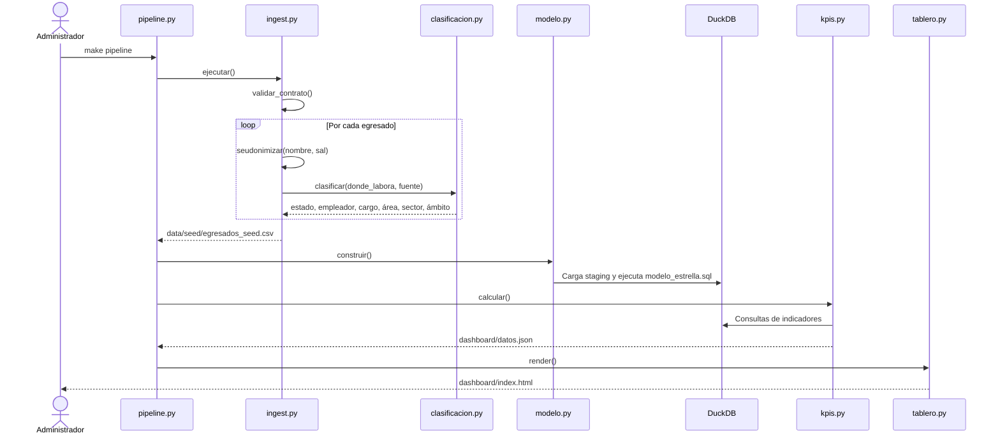

#### Caso de uso 8: Revisar valores no catalogados

| Campo | Descripción |
| --- | --- |
| Actor | Administrador de datos |
| Precondición | La ingesta encontró un texto de "dónde labora" que no está en las tablas curadas. |
| Flujo principal | El indicador de calidad muestra registros "sin clasificar"; el administrador agrega la regla correspondiente en `clasificacion.py` y vuelve a ejecutar el pipeline. |
| Postcondición | Todos los registros quedan clasificados. |

#### Caso de uso 9: Validar cambios

| Campo | Descripción |
| --- | --- |
| Actor | GitHub Actions |
| Precondición | Se envía un cambio o un pull request a la rama `main`. |
| Flujo principal | El workflow instala las dependencias, ejecuta las pruebas, verifica que `data/raw/` no tenga archivos versionados, reconstruye el modelo y el tablero, y publica el tablero como artefacto. |
| Flujo alterno | Si una prueba falla o se detectan datos personales versionados, el workflow falla y el cambio no debe integrarse. |
| Postcondición | El cambio queda validado. |

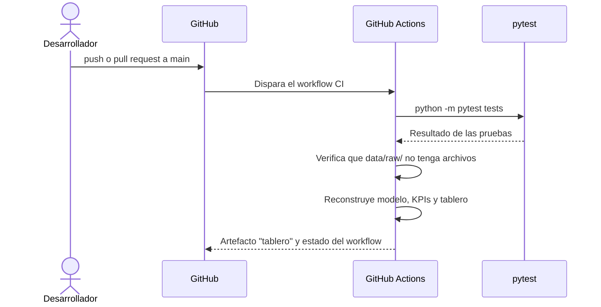

<a id="v-3"></a>

## 3. Modelo lógico

### a) Análisis de objetos

| Objeto | Responsabilidad |
| --- | --- |
| Nómina nominal | Registro de origen con nombre, fecha de grado, dónde labora y fuente. Nunca sale de `data/raw/`. |
| Semilla seudonimizada | Registro por egresado con seudónimo y clasificación, sin nombres. |
| Clasificación | Resultado de interpretar el texto libre: estado, empleador, cargo, área, afinidad, sector, ámbito y confiabilidad. |
| `fact_observacion_laboral` | Observación de la situación laboral de un egresado según una fuente. |
| `dim_egresado` | Seudónimo, año y fecha de grado de cada egresado. |
| `dim_empleador` | Empleador normalizado, con sector y ámbito. |
| `dim_area` | Área de desempeño y si su afinidad es conocida. |
| `dim_fuente` | Fuente de la observación y su nivel de confiabilidad. |
| `dim_tiempo` | Año de grado y periodo (prepandemia, pandemia, pospandemia). |
| Indicadores | Resultados agregados que consume el tablero. |

### b) Diagrama de actividades con objetos

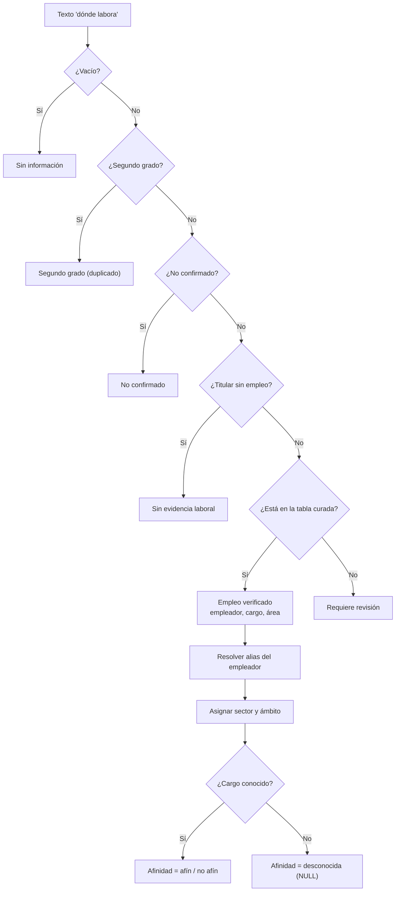

### b.1) Diagrama de flujo de datos

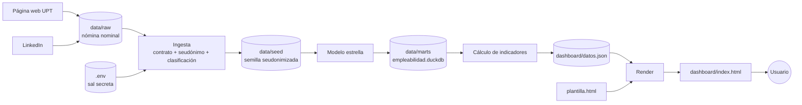

### c) Diagrama de secuencia general

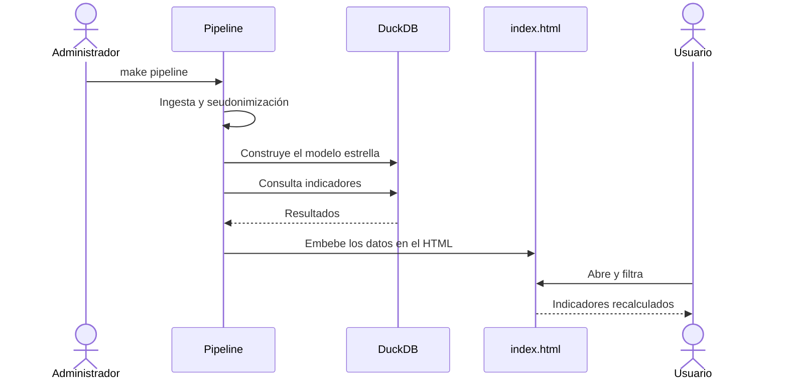

### d) Diagrama de clases

Los módulos del pipeline son funcionales; el diagrama representa cada módulo como una clase con sus funciones y datos principales.

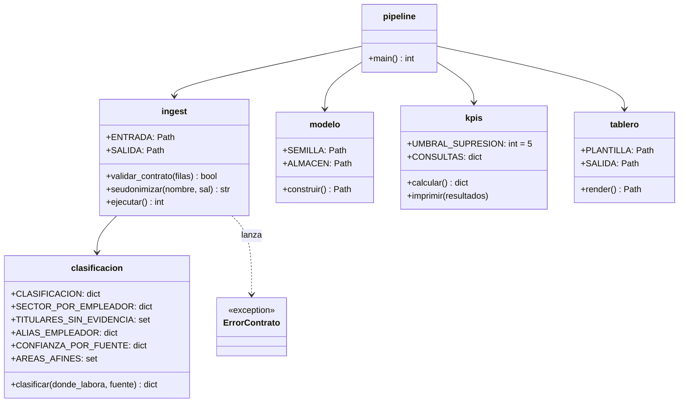

<a id="v-4"></a>

## 4. Artefactos de requisitos complementarios

### a) Diagrama entidad-relación preliminar

Modelo estrella del data mart. El grano de la tabla de hechos es una observación de la situación laboral de un egresado, en una fecha, proveniente de una fuente determinada.

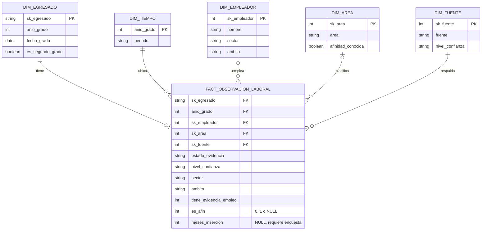

### b) Diagrama de estados

Estados de la evidencia laboral de un egresado.

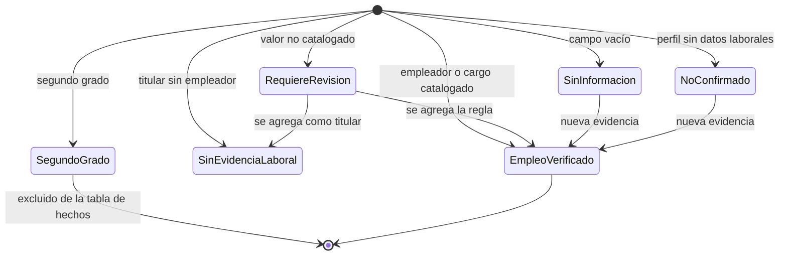

### c) Matriz de trazabilidad de requisitos

| Requisito | Caso de uso | Módulo | Prueba o evidencia |
| --- | --- | --- | --- |
| RF001 Ingesta de la nómina | CU7 | `ingest.py` | Ejecución del pipeline en CI |
| RF002 Contrato de datos | CU7 | `ingest.validar_contrato` | `test_contrato_acepta_fila_valida`, `test_contrato_rechaza_nombre_vacio`, `test_contrato_rechaza_fecha_invalida`, `test_contrato_rechaza_fecha_fuera_de_rango`, `test_contrato_rechaza_nro_duplicado` |
| RF003 Seudonimización | CU7 | `ingest.seudonimizar` | `test_seudonimo_es_determinista`, `test_seudonimo_ignora_mayusculas_y_espacios`, `test_seudonimo_cambia_con_la_sal`, `test_seudonimo_no_contiene_el_nombre` |
| RF004 Estado de la evidencia | CU7 | `clasificacion.clasificar` | `test_campo_vacio_es_sin_informacion`, `test_titular_no_es_empleo`, `test_no_confirmado_no_cuenta_como_empleo`, `test_segundo_grado_se_marca_como_duplicado` |
| RF005 Empleador y cargo | CU7 | `CLASIFICACION` | `test_separa_empleador_y_cargo`, `test_cargo_sin_empleador`, `test_afinidad_desconocida_no_es_falsa` |
| RF006 Resolución de alias | CU7 | `ALIAS_EMPLEADOR` | `test_alias_de_empleador_se_resuelve` |
| RF008 Confiabilidad | CU7 | `CONFIANZA_POR_FUENTE` | `test_confianza_segun_fuente` |
| RF009 Revisión manual | CU8 | `clasificacion.clasificar` | `test_valor_desconocido_se_marca_para_revision` |
| RF010 Modelo dimensional | CU7 | `modelo.py` | Reconstrucción del modelo en CI |
| RF011 Indicadores | CU1 | `kpis.py` | `dashboard/datos.json` |
| RF012 Celdas pequeñas | CU3 | `kpis.py` | Campo `suprimido` en `datos.json` |
| RF013 Generación del tablero | CU7 | `tablero.py` | Artefacto "tablero" en CI |
| RF014–RF015 KPIs y gráficos | CU1 | `plantilla.html` | Revisión visual del tablero |
| RF016 Filtros | CU2, CU3 | `plantilla.html` | Revisión visual del tablero |
| RF017 Vista de tabla | CU4 | `plantilla.html` | Revisión visual del tablero |
| RF018 Nota metodológica | CU5 | `plantilla.html` | Revisión visual del tablero |
| RF020 Orquestación | CU7 | `pipeline.py`, `Makefile` | `make pipeline` |
| RF021 Integración continua | CU9 | `ci.yml` | Historial de ejecuciones en GitHub Actions |

### d) Prototipos o wireframes de pantallas principales

#### Tablero de indicadores

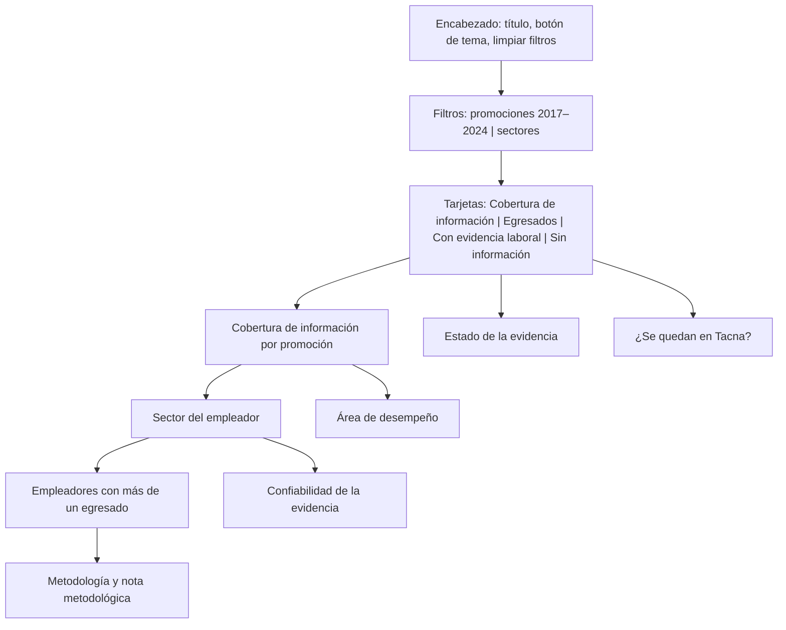

#### Gráfico con vista de tabla

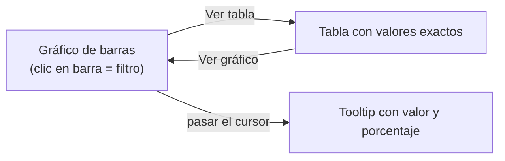

<div style="page-break-after: always; visibility: hidden">\pagebreak</div>

<a id="conclusiones"></a>

# CONCLUSIONES

1. Los requerimientos funcionales finales están implementados y son trazables a módulos y pruebas concretas.
2. La reformulación de la tasa de empleabilidad como cobertura de información es el requerimiento más importante: evita presentar como desempleados a egresados de quienes no hay información.
3. Las reglas de clasificación explícitas y probadas impiden errores frecuentes, como contar titulares profesionales como empleo o forzar la afinidad desconocida a negativa.
4. La protección de datos personales está incorporada en el diseño: los nombres solo se procesan en la ingesta y la nómina no se versiona.
5. Los requerimientos que dependen de fechas de contratación, salarios o modalidad de trabajo quedan postergados hasta disponer de una encuesta.

<div style="page-break-after: always; visibility: hidden">\pagebreak</div>

<a id="recomendaciones"></a>

# RECOMENDACIONES

1. Diseñar y aplicar una encuesta a egresados para cubrir los requerimientos postergados (RFI03, RFI07 y RFI08).
2. Evaluar si el tablero público debe incluir registros individuales seudonimizados o solo agregados, para reducir el riesgo de reidentificación en promociones pequeñas.
3. Agregar pruebas automatizadas para `kpis.py` y para el modelo dimensional.
4. Implementar la exportación de reportes cuando los usuarios lo requieran para la acreditación.
5. Publicar el tablero de forma automática en GitHub Pages desde la integración continua.

<div style="page-break-after: always; visibility: hidden">\pagebreak</div>

<a id="referencias"></a>

# REFERENCIAS BIBLIOGRÁFICAS

- Kimball, R., & Ross, M. (2013). *The Data Warehouse Toolkit: The Definitive Guide to Dimensional Modeling* (3rd ed.). Wiley.
- Few, S. (2013). *Information Dashboard Design: Displaying Data for At-a-Glance Monitoring* (2nd ed.). Analytics Press.
- Sommerville, I. (2016). *Software Engineering* (10th ed.). Pearson.
- Pressman, R. S., & Maxim, B. R. (2020). *Software Engineering: A Practitioner's Approach* (9th ed.). McGraw-Hill.
- Congreso de la República del Perú (2011). *Ley N.º 29733, Ley de Protección de Datos Personales*.
- Documentación de DuckDB: [https://duckdb.org/docs/](https://duckdb.org/docs/)
- Documentación de pytest: [https://docs.pytest.org/](https://docs.pytest.org/)
- Documentación de GitHub Actions: [https://docs.github.com/es/actions](https://docs.github.com/es/actions)
