<center>


**UNIVERSIDAD PRIVADA DE TACNA**

**FACULTAD DE INGENIERÍA**

**Escuela Profesional de Ingeniería de Sistemas**

**Proyecto *Dashboard de empleabilidad de los egresados de Ingeniería de Sistemas de la Universidad Privada de Tacna***

Curso: *Inteligencia de Negocios*

Docente: *CUADROS QUIROGA, PATRICK JOSE*

Integrantes:

***Pacompía Ortiz Abel Fernando (2023076797)***

***Cruz Mamani Victor Williams (2022073903)***

***Vargas Luque Jhony (2022075754)***

**Tacna – Perú**

***2026***

</center>

<div style="page-break-after: always; visibility: hidden">\pagebreak</div>

| CONTROL DE VERSIONES | | | | | |
| :-: | :- | :- | :- | :- | :- |
| **Versión** | **Hecha por** | **Revisada por** | **Aprobada por** | **Fecha** | **Motivo** |
| 1.0 | APO, CMV, VLJ | | | 06/10/2026 | Versión inicial, basada en la solución implementada |

<br>

**Sistema *Dashboard de Empleabilidad de Egresados EPIS-UPT***

**Documento de Arquitectura de Software**

**Versión *1.0***

<div style="page-break-after: always; visibility: hidden">\pagebreak</div>

# ÍNDICE GENERAL

- [I. INTRODUCCIÓN](#i)
  - A. [Propósito (diagrama 4+1)](#i-a)
  - B. [Alcance](#i-b)
  - C. [Definiciones, siglas y abreviaturas](#i-c)
  - D. [Referencias](#i-d)
- [II. REPRESENTACIÓN ARQUITECTÓNICA](#ii)
  - [Diagrama de arquitectura general](#ii-general)
  - A. [Vista de escenarios](#ii-a)
  - B. [Vista lógica](#ii-b)
  - C. [Vista del proceso](#ii-c)
  - D. [Vista del desarrollo](#ii-d)
  - E. [Vista física](#ii-e)
- [III. OBJETIVOS Y LIMITACIONES ARQUITECTÓNICAS](#iii)
  - A. [Disponibilidad](#iii-a)
  - B. [Seguridad](#iii-b)
  - C. [Decisiones arquitectónicas](#iii-c)
  - D. [Restricciones](#iii-d)
- [IV. ANÁLISIS DE REQUERIMIENTOS](#iv)
- [V. VISTA DE CASOS DE USO](#v)
- [VI. VISTA LÓGICA](#vi)
- [VII. VISTA DE PROCESOS](#vii)
- [VIII. VISTA DE DESPLIEGUE](#viii)
- [IX. VISTA DE IMPLEMENTACIÓN](#ix)
- [X. VISTA DE DATOS](#x)
- [XI. CALIDAD](#xi)
- [CONCLUSIONES](#conclusiones)
- [RECOMENDACIONES](#recomendaciones)

<div style="page-break-after: always; visibility: hidden">\pagebreak</div>

<a id="i"></a>

# I. INTRODUCCIÓN

<a id="i-a"></a>

## A. Propósito (diagrama 4+1)

Este documento describe la arquitectura del **Dashboard de empleabilidad de los egresados de Ingeniería de Sistemas de la UPT**, una solución de Inteligencia de Negocios compuesta por un pipeline de datos en Python, un data mart dimensional en DuckDB y un tablero web estático.

La arquitectura se presenta con un enfoque basado en el modelo **4+1 vistas**:

- Vista de casos de uso (escenarios).
- Vista lógica.
- Vista de procesos.
- Vista de desarrollo (implementación).
- Vista física (despliegue).

El objetivo es mostrar cómo se organizan los componentes, cómo interactúan y qué decisiones técnicas sostienen los atributos de calidad del sistema, en particular la privacidad, la validez metodológica y la reproducibilidad.

<a id="i-b"></a>

## B. Alcance

El documento cubre:

- El pipeline de datos: ingesta, seudonimización, clasificación, modelo, indicadores y render.
- El data mart dimensional (modelo estrella) en DuckDB.
- El tablero web estático y su lógica de filtrado en el navegador.
- La integración continua con GitHub Actions.
- Las medidas de protección de datos personales.
- Las decisiones de arquitectura registradas en `docs/adr/`.

No cubre la futura encuesta a egresados, que se integraría como una nueva fuente del pipeline.

<a id="i-c"></a>

## C. Definiciones, siglas y abreviaturas

| Término | Definición |
| --- | --- |
| BI | Inteligencia de Negocios (Business Intelligence). |
| ETL | Extracción, transformación y carga de datos. |
| Pipeline | Secuencia automatizada de etapas que transforma los datos de origen en el tablero. |
| Data mart | Almacén de datos orientado a un tema, organizado para el análisis. |
| Modelo estrella | Modelo dimensional con una tabla de hechos y tablas de dimensiones. |
| DuckDB | Motor de base de datos analítica, columnar y embebido en un archivo. |
| Staging | Tabla intermedia que replica los datos de origen sin transformar. |
| Seudonimización | Reemplazo de la identidad por un identificador no reversible sin una clave secreta. |
| Sal | Valor secreto que se combina con el nombre antes de calcular el hash. |
| SHA-256 | Función de hash criptográfica utilizada para generar los seudónimos. |
| KPI | Indicador clave de desempeño. |
| ADR | Registro de decisión de arquitectura (Architecture Decision Record). |
| CI | Integración continua mediante GitHub Actions. |
| Celda pequeña | Grupo de datos con menos de 5 casos, con riesgo de identificar a una persona. |

<a id="i-d"></a>

## D. Referencias

- FD01 – Informe de Factibilidad, versión 1.1.
- FD02 – Documento de Visión, versión 1.1.
- FD03 – Documento de Especificación de Requerimientos de Software, versión 1.0.
- ADR 001 – DuckDB en lugar de PostgreSQL.
- ADR 002 – Reportar cobertura de información, no tasa de empleabilidad.
- ADR 003 – La afinidad formativa es tri-estado, no booleana.
- Kimball, R., & Ross, M. (2013). *The Data Warehouse Toolkit* (3rd ed.). Wiley.
- Documentación de DuckDB: [https://duckdb.org/docs/](https://duckdb.org/docs/)
- Documentación de GitHub Actions: [https://docs.github.com/es/actions](https://docs.github.com/es/actions)

<div style="page-break-after: always; visibility: hidden">\pagebreak</div>

<a id="ii"></a>

# II. REPRESENTACIÓN ARQUITECTÓNICA

<a id="ii-general"></a>

### Diagrama de arquitectura general

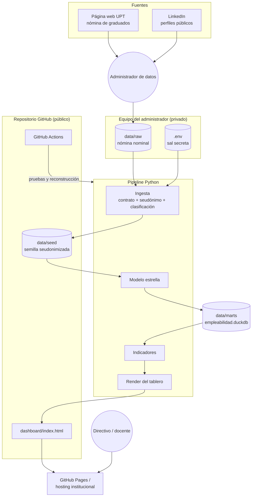

<a id="ii-a"></a>

## A. Vista de escenarios

### Diagrama C4 de contexto

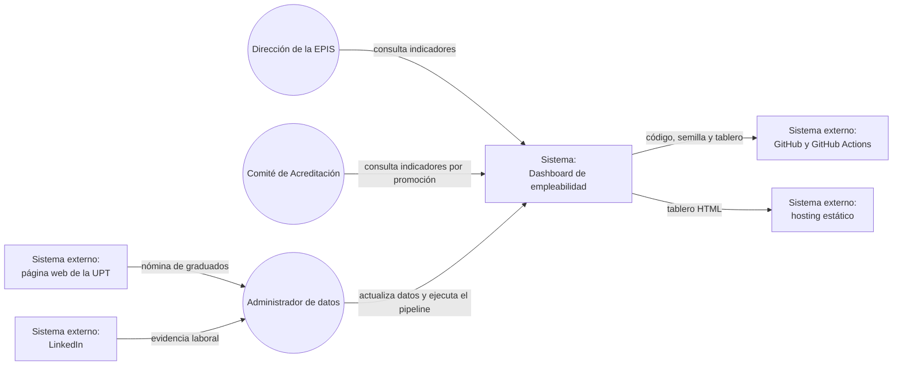

### Diagrama de casos de uso

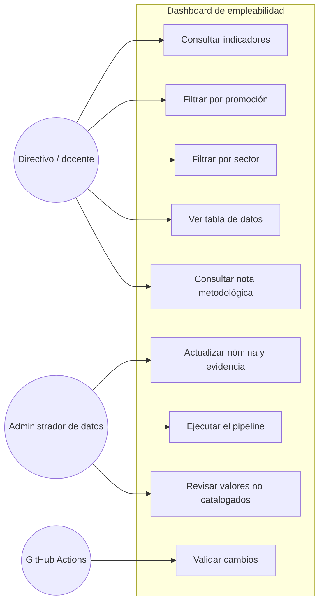

<a id="ii-b"></a>

## B. Vista lógica

### Diagrama de subsistemas

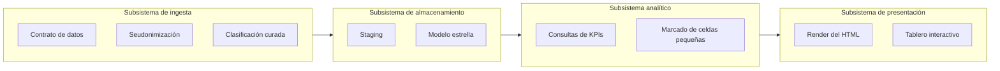

### Diagrama de secuencia general

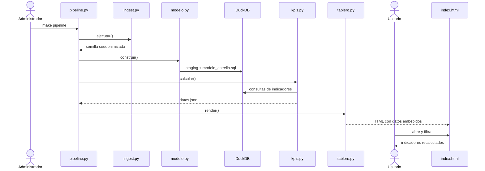

### Diagrama de colaboración

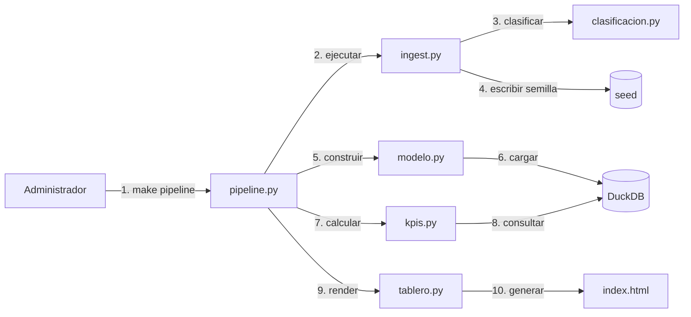

### Diagrama de objetos

Ejemplo de un egresado procesado por el pipeline (valores ilustrativos).

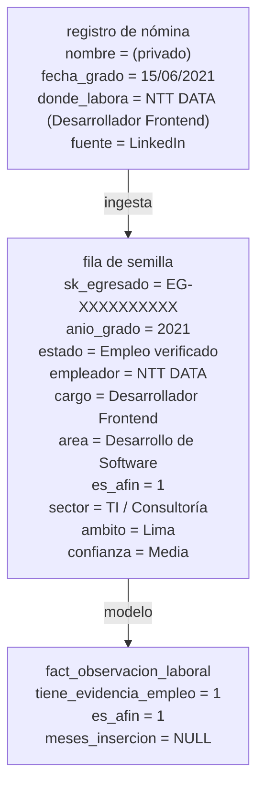

### Diagrama de clases

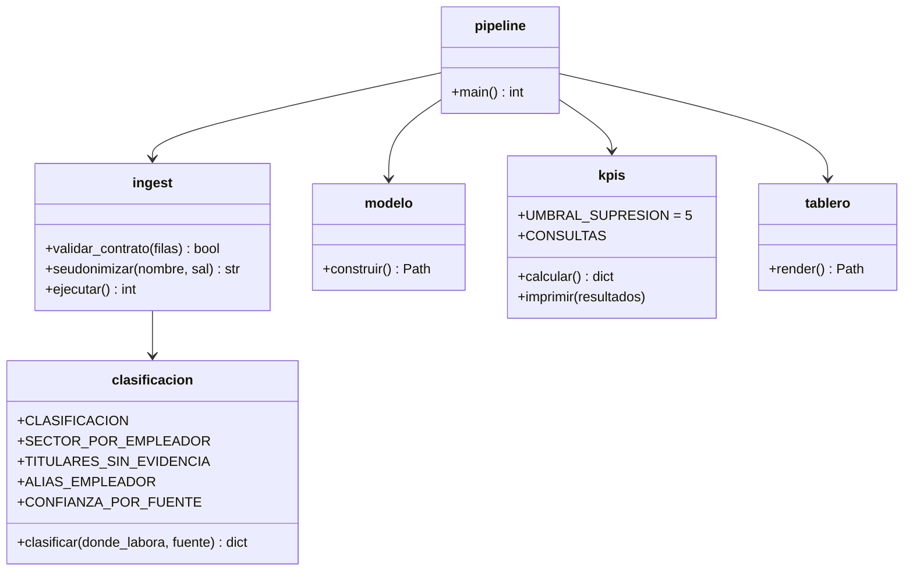

<a id="ii-c"></a>

## C. Vista del proceso

### Diagrama de actividades del sistema

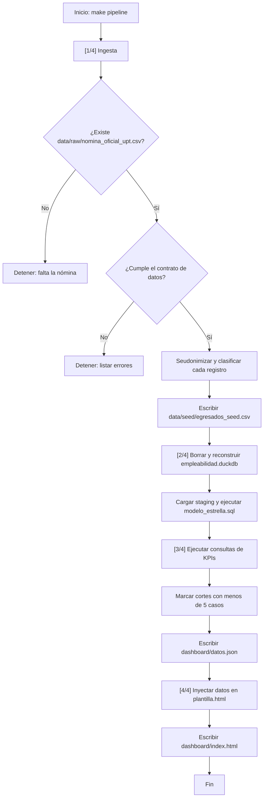

### Diagrama de flujo técnico del tablero

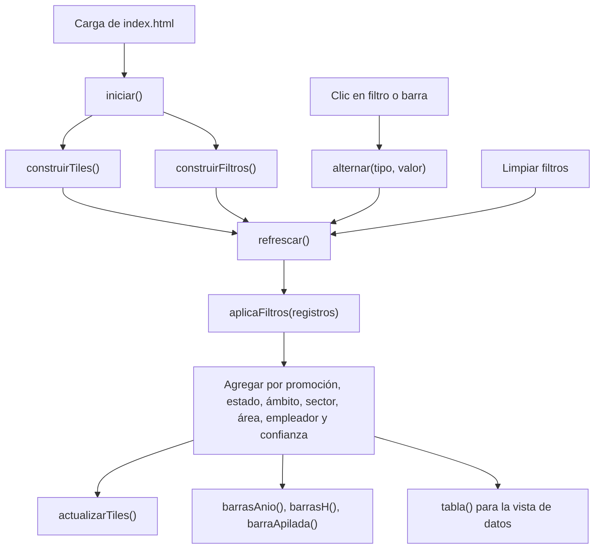

<a id="ii-d"></a>

## D. Vista del desarrollo

### Diagrama de capas del pipeline

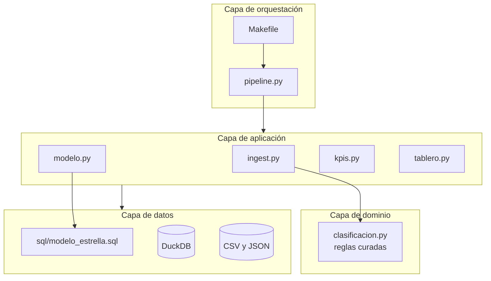

### Diagrama de capas del tablero

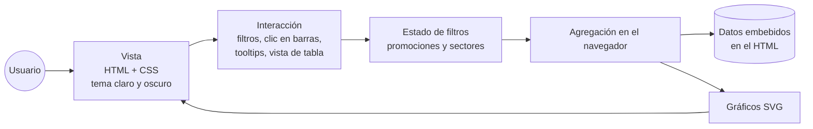

### Diagrama de paquetes o módulos

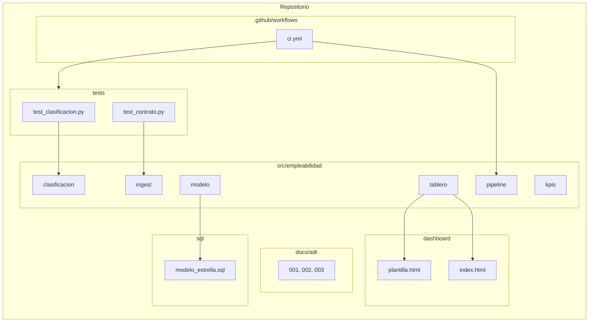

<a id="ii-e"></a>

## E. Vista física

### Diagrama C4 de contenedores

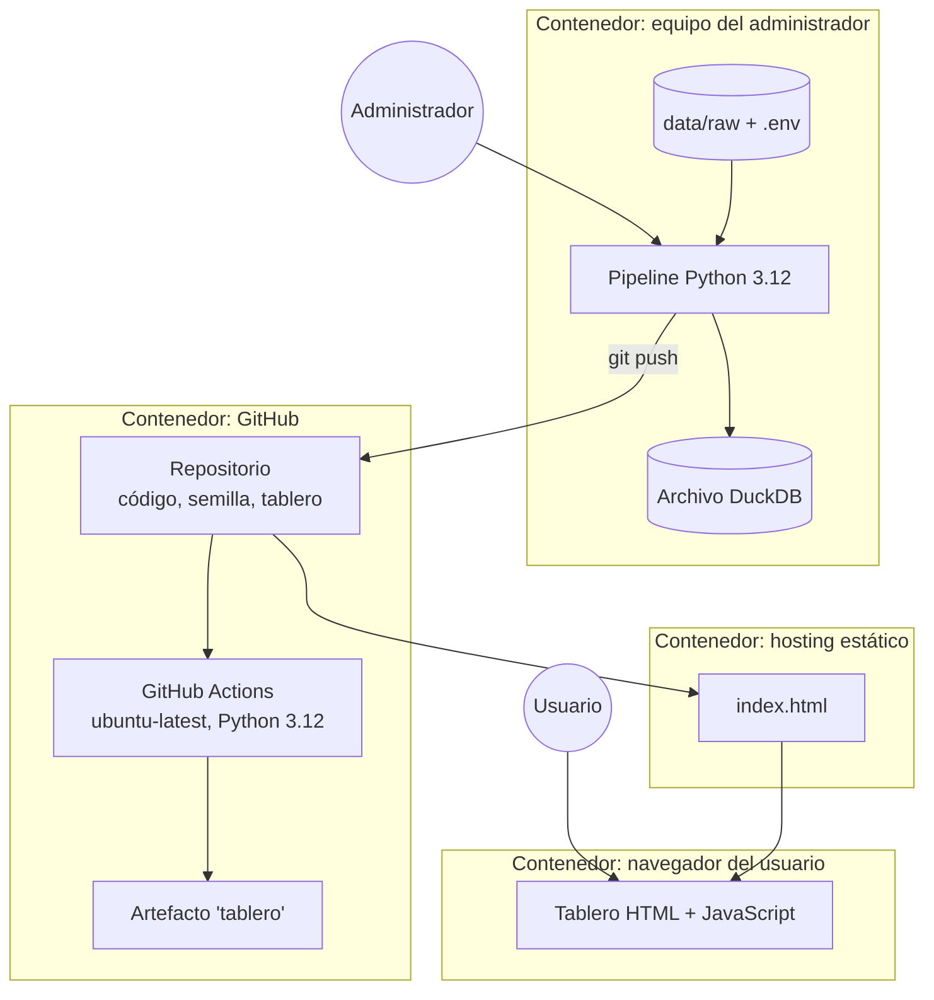

### Diagrama de integración con servicios externos

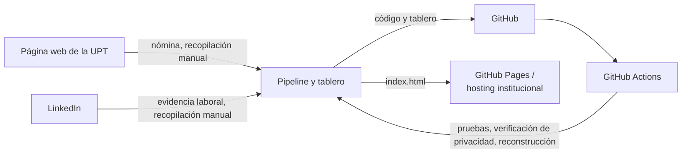

La recopilación de la nómina y de la evidencia de LinkedIn es manual; el sistema no se conecta automáticamente a esas fuentes.

**Escalabilidad:**

- El volumen actual (139 egresados) y su crecimiento previsible (alrededor de 20 a 30 graduados por año) están muy por debajo de la capacidad de DuckDB.
- El tablero recalcula los indicadores en el navegador, sin carga en ningún servidor.
- Una nueva fuente, como una encuesta, se integraría como una etapa adicional de ingesta sin cambiar el modelo, que ya reserva la columna `meses_insercion`.

**Disponibilidad:**

- El tablero es un archivo autocontenido que funciona sin servidor ni conexión.
- La disponibilidad pública depende del hosting estático elegido.

<div style="page-break-after: always; visibility: hidden">\pagebreak</div>

<a id="iii"></a>

# III. OBJETIVOS Y LIMITACIONES ARQUITECTÓNICAS

<a id="iii-a"></a>

## A. Disponibilidad

El tablero no depende de servicios en ejecución: es un archivo HTML con los datos embebidos, que funciona abierto desde el disco, en GitHub Pages o en cualquier hosting estático. El pipeline solo se ejecuta al actualizar los datos.

<a id="iii-b"></a>

## B. Seguridad

La arquitectura aplica la privacidad desde el diseño: los nombres solo existen en `data/raw/` y en memoria durante la ingesta. A partir de la semilla, todo el sistema opera sobre seudónimos.

### Diagrama de seguridad

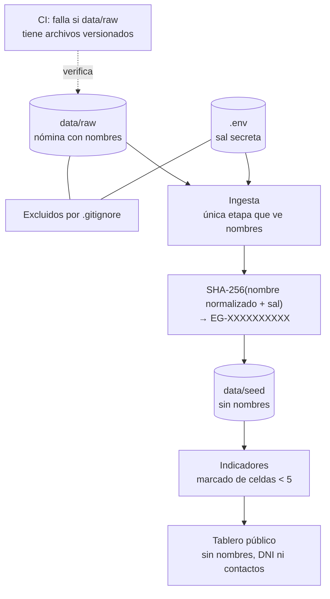

**Riesgo residual.** El tablero embebe los registros individuales seudonimizados (promoción, empleador, área, sector y ámbito) para recalcular los indicadores en el navegador. Aunque no contiene nombres, en promociones pequeñas la combinación de esos atributos podría permitir reconocer a un egresado. Actualmente, los cortes con menos de 5 casos se marcan y se advierten, pero no se ocultan. Ver recomendaciones.

<a id="iii-c"></a>

## C. Decisiones arquitectónicas

| ADR | Decisión | Motivo |
| --- | --- | --- |
| 001 | DuckDB en lugar de PostgreSQL | 139 registros, cargas semestrales y lecturas analíticas. Un motor cliente-servidor exigiría servidor, credenciales y mantenimiento sin beneficio. El almacén es un archivo. |
| 002 | Reportar cobertura de información, no tasa de empleabilidad | Las fuentes públicas no distinguen a un egresado desempleado de uno que no publica. |
| 003 | Afinidad tri-estado | Con empleador pero sin cargo, la afinidad es desconocida; forzarla a falsa o verdadera sesgaría el indicador. |
| — | Tablero estático con datos embebidos | Funciona desde `file://`, en GitHub Pages y en cualquier hosting, sin licencias ni servidor. |
| — | Clasificación curada en lugar de heurística | Con 35 registros con evidencia, una tabla explícita es más auditable que una regla automática. |

<a id="iii-d"></a>

## D. Restricciones

### Restricciones técnicas

- El pipeline requiere Python 3.12 y DuckDB 1.4 o superior.
- La ingesta requiere la nómina nominal en `data/raw/`, que no está en el repositorio.
- La seudonimización en producción requiere una sal real en `.env`; sin ella se usa una sal de desarrollo.
- El modelo se reconstruye completo en cada ejecución.

### Restricciones operacionales

- La recopilación de la evidencia de LinkedIn es manual.
- Los valores nuevos de "dónde labora" deben catalogarse en `clasificacion.py`.
- La publicación del tablero no está automatizada: la integración continua genera el tablero como artefacto.

### Restricciones del negocio

- La cobertura de información no debe presentarse como tasa de empleabilidad.
- El tiempo de inserción, el salario y la modalidad de trabajo requieren una encuesta.
- El tratamiento de datos debe cumplir la Ley N.º 29733.

<div style="page-break-after: always; visibility: hidden">\pagebreak</div>

<a id="iv"></a>

# IV. ANÁLISIS DE REQUERIMIENTOS

## 4.1 Priorización de requerimientos

### A. Requerimientos funcionales

| ID | Requerimiento arquitectónico |
| --- | --- |
| RF-A01 | Validar la nómina de entrada mediante un contrato de datos que detenga el pipeline ante errores. |
| RF-A02 | Seudonimizar la identidad de los egresados de forma determinista. |
| RF-A03 | Clasificar el texto libre de la evidencia laboral mediante tablas curadas. |
| RF-A04 | Construir un modelo estrella cuyo grano incluya la fuente de cada observación. |
| RF-A05 | Calcular los indicadores con denominadores explícitos. |
| RF-A06 | Marcar los cortes con menos de 5 casos. |
| RF-A07 | Generar un tablero autocontenido con los datos embebidos. |
| RF-A08 | Recalcular los indicadores en el navegador según los filtros aplicados. |
| RF-A09 | Reconstruir todo el sistema con un solo comando. |
| RF-A10 | Validar cada cambio mediante integración continua. |

### B. Requerimientos no funcionales

| ID | Atributo | Decisiones arquitectónicas |
| --- | --- | --- |
| RNF-A01 | Privacidad | Seudonimización con sal, `data/raw/` excluido del repositorio, verificación en la CI. |
| RNF-A02 | Validez metodológica | Indicador de cobertura, afinidad tri-estado y nota metodológica embebida en el tablero. |
| RNF-A03 | Reproducibilidad | Modelo idempotente reconstruido desde la semilla en cada ejecución. |
| RNF-A04 | Calidad de datos | Contrato de datos y estado "Requiere revisión" para valores desconocidos. |
| RNF-A05 | Mantenibilidad | Un módulo por etapa del pipeline y reglas de clasificación separadas del código de ejecución. |
| RNF-A06 | Portabilidad | Tablero HTML sin dependencias externas. |
| RNF-A07 | Auditabilidad | Reglas curadas versionadas y decisiones documentadas en ADR. |
| RNF-A08 | Integración continua | Workflow `CI` con pruebas, verificación de privacidad y reconstrucción. |
| RNF-A09 | Costo | Solo tecnologías de código abierto y servicios gratuitos. |

<div style="page-break-after: always; visibility: hidden">\pagebreak</div>

<a id="v"></a>

# V. VISTA DE CASOS DE USO

El diagrama resume las interacciones de los consultores, el administrador de datos y la integración continua con el sistema.

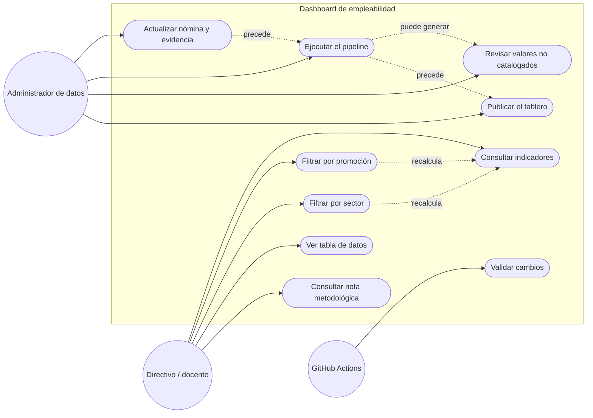

<a id="vi"></a>

# VI. VISTA LÓGICA

## A. Diagrama contextual

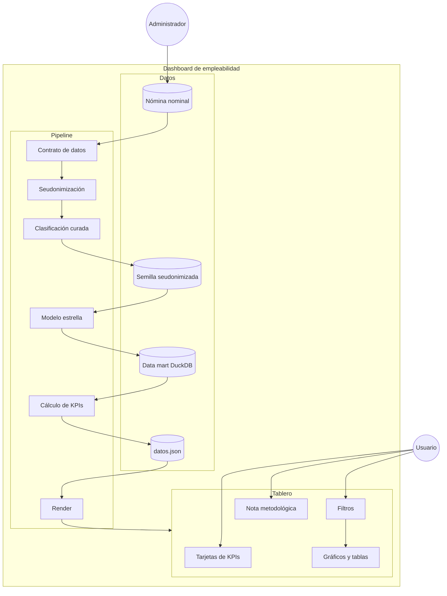

<a id="vii"></a>

# VII. VISTA DE PROCESOS

## A. Diagrama de proceso actual

El proceso actual corresponde al seguimiento manual de los egresados mediante búsquedas individuales y hojas de cálculo.

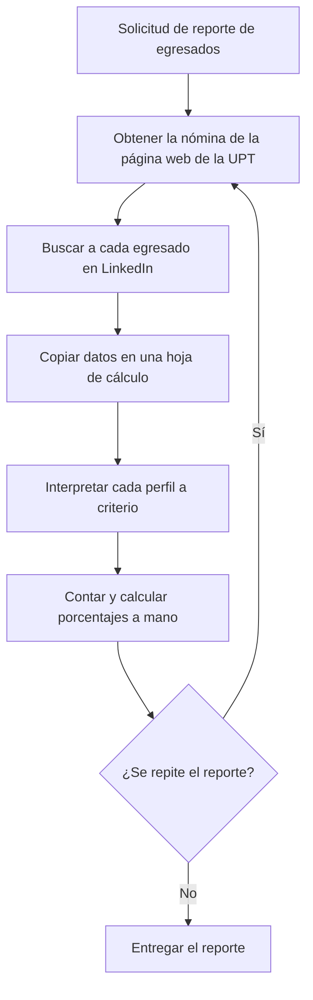

## B. Diagrama de proceso propuesto

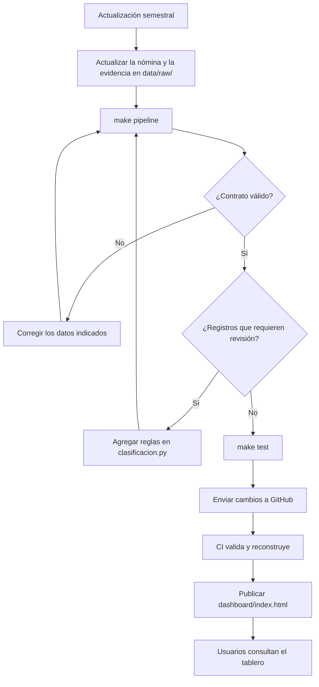

<a id="viii"></a>

# VIII. VISTA DE DESPLIEGUE

## A. Diagrama de contenedor

```mermaid
flowchart TB
    Admin((Administrador))
    Dev((Desarrollador))
    Usuario((Usuario))

    subgraph Local["Equipo del administrador"]
        Py["Python 3.12 + DuckDB"]
        RawEnv[("data/raw + .env<br/>no versionados")]
        Mart[("data/marts<br/>no versionado")]
    end

    subgraph GH["GitHub"]
        Repo["Repositorio<br/>src, sql, tests, data/seed, dashboard, docs"]
        subgraph Actions["GitHub Actions (ubuntu-latest)"]
            T["pytest"]
            P["Verificación de data/raw"]
            R["Reconstrucción del tablero"]
            A["Artefacto 'tablero'"]
        end
    end

    subgraph Host["Hosting estático"]
        Index["index.html"]
    end

    subgraph Browser["Navegador del usuario"]
        UI["Tablero"]
    end

    Admin --> Py
    RawEnv --> Py
    Py --> Mart
    Py -->|commit| Repo
    Dev -->|push / pull request| Repo
    Repo --> T --> P --> R --> A
    Repo --> Index
    Usuario --> UI
    Index --> UI
```

<a id="ix"></a>

# IX. VISTA DE IMPLEMENTACIÓN

## A. Diagrama de componentes – pipeline de datos

```mermaid
flowchart TB
    subgraph Pipeline["src/empleabilidad"]
        P["pipeline.py<br/>orquestador"]

        subgraph Ingesta["ingest.py"]
            VC["validar_contrato()"]
            SD["seudonimizar()"]
            EJ["ejecutar()"]
        end

        subgraph Clasificacion["clasificacion.py"]
            CL["clasificar()"]
            TC["CLASIFICACION"]
            SE["SECTOR_POR_EMPLEADOR"]
            TI["TITULARES_SIN_EVIDENCIA"]
            AL["ALIAS_EMPLEADOR"]
            CF["CONFIANZA_POR_FUENTE"]
        end

        M["modelo.py<br/>construir()"]
        K["kpis.py<br/>calcular(), imprimir()"]
        T["tablero.py<br/>render()"]
    end

    SQL["sql/modelo_estrella.sql"]
    Tests["tests/<br/>19 pruebas"]

    P --> EJ & M & K & T
    EJ --> VC & SD & CL
    CL --> TC & SE & TI & AL & CF
    M --> SQL
    Tests --> VC & SD & CL
```

## B. Diagrama de componentes – tablero

```mermaid
flowchart TB
    subgraph Tablero["dashboard/index.html"]
        Datos["DATOS<br/>(JSON embebido)"]

        subgraph Inicio["Inicialización"]
            INI["iniciar()"]
            CT["construirTiles()"]
            CF["construirFiltros()"]
        end

        subgraph Estado["Estado y filtros"]
            F["F = { anios, sectores }"]
            ALT["alternar()"]
            AF["aplicaFiltros()"]
        end

        subgraph Render["Render"]
            REF["refrescar()"]
            AT["actualizarTiles()"]
            BA["barrasAnio()"]
            BH["barrasH()"]
            BAP["barraApilada()"]
            TB["tabla()"]
            TT["conTooltip()"]
        end

        Tema["Tema claro / oscuro"]
    end

    INI --> CT & CF
    CF --> ALT
    ALT --> F --> REF
    REF --> AF --> Datos
    REF --> AT & BA & BH & BAP & TB
    BA & BH --> TT
    BA & BH -->|clic| ALT
```

<a id="x"></a>

# X. VISTA DE DATOS

## A. Diagrama entidad-relación

Modelo estrella del data mart (`sql/modelo_estrella.sql`). El grano de la tabla de hechos es una observación de la situación laboral de un egresado, en una fecha, proveniente de una fuente determinada. Modelar la fuente es deliberado: un perfil directo y una entrada de directorio no son evidencia del mismo peso.

```mermaid
erDiagram
    DIM_EGRESADO ||--o| FACT_OBSERVACION_LABORAL : "tiene"
    DIM_TIEMPO ||--o{ FACT_OBSERVACION_LABORAL : "ubica"
    DIM_EMPLEADOR |o--o{ FACT_OBSERVACION_LABORAL : "emplea"
    DIM_AREA |o--o{ FACT_OBSERVACION_LABORAL : "clasifica"
    DIM_FUENTE ||--o{ FACT_OBSERVACION_LABORAL : "respalda"

    DIM_EGRESADO {
        string sk_egresado PK
        int anio_grado
        date fecha_grado
        boolean es_segundo_grado
    }

    DIM_TIEMPO {
        int anio_grado PK
        string periodo "Pre-pandemia, Pandemia, Post-pandemia"
    }

    DIM_EMPLEADOR {
        int sk_empleador PK
        string nombre
        string sector
        string ambito
    }

    DIM_AREA {
        int sk_area PK
        string area
        boolean afinidad_conocida
    }

    DIM_FUENTE {
        int sk_fuente PK
        string fuente
        string nivel_confianza
    }

    FACT_OBSERVACION_LABORAL {
        string sk_egresado FK
        int anio_grado FK
        int sk_empleador FK
        int sk_area FK
        int sk_fuente FK
        string estado_evidencia
        string nivel_confianza
        string sector
        string ambito
        int tiene_evidencia_empleo
        int es_afin "0, 1 o NULL"
        int meses_insercion "NULL hasta la encuesta"
    }
```

| Tabla | Filas | Observación |
| --- | ---: | --- |
| `fact_observacion_laboral` | 139 | Excluye los 2 segundos grados. |
| `dim_egresado` | 141 | Incluye los segundos grados, marcados con `es_segundo_grado`. |
| `dim_tiempo` | 8 | Promociones 2017 a 2024. |

<div style="page-break-after: always; visibility: hidden">\pagebreak</div>

<a id="xi"></a>

# XI. CALIDAD

## A. Escenario de seguridad y privacidad

| Escenario | Descripción | Implementación |
| --- | --- | --- |
| ES001 | Un integrante intenta subir la nómina con nombres al repositorio. | `.gitignore` excluye `data/raw/` y la CI falla si encuentra archivos versionados ahí. |
| ES002 | Un tercero intenta recuperar nombres a partir de los seudónimos. | SHA-256 con sal secreta fuera del repositorio; prueba `test_seudonimo_cambia_con_la_sal`. |
| ES003 | Un usuario combina filtros hasta aislar a un egresado. | Cortes con menos de 5 casos marcados y advertencia en el tablero. Riesgo residual: el detalle no se oculta. |

## B. Escenario de validez metodológica

| Escenario | Descripción | Implementación |
| --- | --- | --- |
| EV001 | Un directivo presenta la cobertura como tasa de empleo. | El indicador se llama "cobertura de información" y la advertencia está dentro del tablero (ADR 002). |
| EV002 | Un titular "Egresado UPT" se cuenta como empleo. | Regla `TITULARES_SIN_EVIDENCIA` y prueba `test_titular_no_es_empleo`. |
| EV003 | Un empleo sin cargo se cuenta como no afín. | Afinidad tri-estado y prueba `test_afinidad_desconocida_no_es_falsa` (ADR 003). |

## C. Escenario de usabilidad

| Escenario | Descripción | Implementación |
| --- | --- | --- |
| EU001 | El usuario quiere ver una promoción. | Botones de filtro y clic directo en las barras. |
| EU002 | El usuario necesita la cifra exacta. | Vista de tabla en cada gráfico y tooltips. |
| EU003 | El usuario consulta desde un teléfono o con tema oscuro. | Diseño adaptable y alternancia de tema. |

## D. Escenario de mantenibilidad y adaptabilidad

| Escenario | Descripción | Implementación |
| --- | --- | --- |
| EA001 | Aparece un empleador nuevo en LinkedIn. | Se marca "Requiere revisión"; el administrador agrega una línea en `clasificacion.py`. |
| EA002 | Se incorpora una encuesta. | Nueva fuente en la ingesta; el modelo ya reserva `meses_insercion`. |
| EA003 | La universidad exige PostgreSQL. | El SQL del modelo es estándar; la migración es de conector, no de modelo (ADR 001). |

## E. Escenario de disponibilidad y reproducibilidad

| Escenario | Descripción | Implementación |
| --- | --- | --- |
| ED001 | El hosting no está disponible. | El archivo `index.html` funciona abierto desde el disco. |
| ED002 | Se necesita reconstruir los indicadores. | `make pipeline` reconstruye todo; el modelo es idempotente. |
| ED003 | Un cambio rompe la clasificación. | La CI ejecuta las 19 pruebas en cada push o pull request a `main`. |

<div style="page-break-after: always; visibility: hidden">\pagebreak</div>

<a id="conclusiones"></a>

# CONCLUSIONES

1. La arquitectura separa con claridad la ingesta, el almacenamiento, el análisis y la presentación, con un módulo por etapa.
2. La privacidad está incorporada en el diseño: los nombres solo se procesan en la ingesta y la integración continua impide versionar la nómina.
3. DuckDB y un tablero estático eliminan servidores, licencias y mantenimiento de infraestructura, lo que favorece la continuidad del proyecto.
4. El modelo estrella registra la fuente de cada observación y reserva las columnas necesarias para incorporar una encuesta sin rediseño.
5. Las decisiones metodológicas (cobertura frente a empleabilidad y afinidad tri-estado) están documentadas y protegidas por pruebas.

<div style="page-break-after: always; visibility: hidden">\pagebreak</div>

<a id="recomendaciones"></a>

# RECOMENDACIONES

1. Publicar en el tablero solo indicadores agregados, u ocultar los cortes con menos de 5 casos, para eliminar el riesgo residual de reidentificación.
2. Automatizar la publicación del tablero en GitHub Pages desde la integración continua.
3. Agregar pruebas automatizadas para `kpis.py` y para el modelo dimensional.
4. Definir el formato de la futura encuesta y su etapa de ingesta.
5. Documentar el procedimiento de actualización semestral para el responsable designado.
